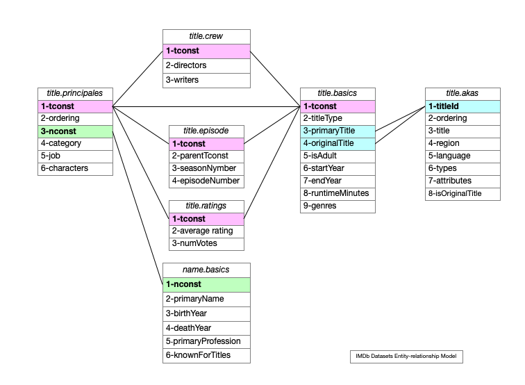

---
toc:
    depth_from: 1
    depth_to: 3
    ordered: false
---  
  
#  IMDb Dataset Processing
  
[TOC]

##  Tasks
  
  
- [x]   Shell arguments
- [x]   References
- [ ]   User interface
- [x]   Title case `actor_name`
- [ ]   Iterative Refactoring
- [x]   Export links to IMDb datasets as environmental variables
- [x]   Create cache directory for each IMDb dataset
  - [x] name_basics directory
*NOTE - check if  `query_results.csv` exists*  
Example query results - `John_Wayne_1907_actor`
    - [x]   `headers_name.basics.csv`
    - [x]   `query_results.csv`
    - [x]   `query_results.nconst`

  - [x] title_principals directory
    - [x]   `headers_title.principals.csv`
    - [ ]   `query_results.csv`
    - [ ]   `query_results.nconst`

  - [x] title_basics directory
  - [x] Environmental variables ln -s to IMDb datasets
  
##  IMDb Entity-relationship Model 
  
  

  
##  IMDb Datasets Overview
  
  
**NOTE** *"Subsets of IMDb data are available for access to customers for personal and non-commercial use. You can hold local copies of this data, and it is subject to our terms and conditions. Please refer to the Non-Commercial Licensing and copyright/license and verify compliance."* [IMDb Datasets](https://www.imdb.com/interfaces/ ) []
  | Dataset | Contents |
  | :--------- | :---------- |
|  `name.basics.tsv.gz`|    information for names |
|  `title.akas.tsv.gz` |   localized title information |
|  `title.basics.tsv.gz` |   information about titles |
|  `title.crew.tsv.gz`|    director and writer information  |
|  `title.episode.tsv.gz ` |    tv episode information |
|  `title.principals.tsv.gz` |    principal cast / crew for titles |
|  `title.ratings.tsv.gz`|    IMDb rating and votes information for titles
  
## Links to IMDb Datasets Exports

Links to IMDb datasets are exported as environmental variables so shell scripts can easily access them. 

An example of use is `rg "John Wayne" name_basics`

```bash
# add exports to .zshrc

ln -s /Volumes/Dev/imdb/imdb_dataset_files/name.basics.csv name_basics
export $name_basics

ln -s /Volumes/Dev/imdb/imdb_dataset_files/title.akas.csv title_akas
export $title_akas

ln -s /Volumes/Dev/imdb/imdb_dataset_files/title.crew.csv title_crew
export $title_crew

ln -s /Volumes/Dev/imdb/imdb_dataset_files/title.episode.csv title_episode
export $title_episodes

ln -s /Volumes/Dev/imdb/imdb_dataset_files/title.principals.csv title_principals
export title_principals

ln -s /Volumes/Dev/imdb/imdb_dataset_files/title.ratings.csv title_ratings
export title_ratings
```

##  Dataset Keys

  
`nconst` is the *name* constant and the first attribute of the `name.basics` dataset. It is used  for querying the `title.principales` dataset.

`nconst` points to `tconst` constants in the `title.principales` dataset.  They are used to query other IMDb datasets as shown in the diagram above.
  
  
##  Query Examples
  
  
The `rg` [ripgrep](https://crates.io/crates/ripgrep ) command line search utility tool   recursively searches dictories using a  `regex` pattern.
  
The query: `rg ',John Wayne,\d+,' name.basics.csv | rg 'actor'` 
Produces the record: `nm0000078,John Wayne,1907,1979,actor,producer,soundtrack,tt0031971,tt0065126,tt0056217,tt0053580`. This record is saved as a cache file as `imdb_dataset_cache/name_basics/csv_John_Wayne_name.basics`
  
The` \d+,` after `,John Wayne,` in the query regex further qualifies the query so the `primaryName` field is followed immediately by a the `birthYear` field containing digits.
  
The first field from the `name.basics.csv` dataset query is used to query the `title.principals.csv` dataset. 
The query `rg 'nm0000078,actor,' title.principals.csv` 
Produces a list of `tconst` value and `character` played by the actor. 
The first record returned from this query is `tt0020691,1,nm0000078,actor,\N,"[""Breck Coleman""]"`,  Each `tconst` value returned  is used to query other IMDb datasets.
  
The record returned by the query 
`rg 'tt0020691' title.basics.csv` is
`tt0020691,movie,The Big Trail,The Big Trail,0,1930,\N,125,Adventure,Romance,Western`
  
The query `rg 'tt0020691` title.principals.csv returns up to 10 records containing the character names of played by other actor and actress, and writers, directors, and other jobs. The record for character *Ruth Cameron* is `tt0020691,2,nm0161451,actress,\N,"[""Ruth Cameron""]"`
  
The query `rg 'nm0161451' name.basics.csv` returns the record `nm0161451,Marguerite Churchill,1910,2000,actress,tt0028478,tt0021606,tt0027545,tt0020691` for the actress who played the character *Ruth Cameron*
  
  
##  dev Directory Structure

@import "block_start.md"
@import "dirtree.md"
@import "block_end.md"

```

  
  
##  References
  
  
[]: [Entity-relationship model](https://en.wikipedia.org/wiki/Entity–relationship_model )
  
[]: [`xsv` - High performance CSV command line toolkit](https://lib.rs/crates/xsv )
  
[]: [Bash Reference Manual](https://www.gnu.org/software/bash/manual/html_node/index.html#SEC_Contents )
  
[]: [Bash Quoting](https://www.gnu.org/software/bash/manual/html_node/Quoting.html )
  
[]: [`regex` - Regular expression](https://en.wikipedia.org/wiki/Regular_expression )
  
  