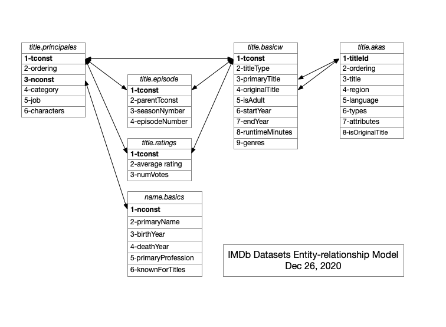

# IMDb
[Internet Movie Database](https://www.imdb.com)

Jan 17, 2021

## File Directories

`rad indba` => imdb_dataset_attributes
`rad imdbd` => imdb_datasets
`rad imdbo` => imdb_processing_out
`rad imdbp` => imdb_processing

## IMDb Datasets Entity-relationship Model

## Processing

==Note:== `dataset` refers to an IMDb dataset

### name.basics Dataset

Processing starts with querying `IMDb_name.basics.csv`. It is one of the 6 `IMDb_datasets` One or more attributes are selected.` primaryName` and `primaryProfession` are used to select a person and profession, such as John Wayne, Actor. Other attributes are available  for more specific selections such as,`birthYear`, `deathYear` and `knowForTitles` 

The csv row or rows are selected from the `name.basics` dataset containing values for the selected attributes, as well for the other attributes such as 'nconst'. It is the key to the rest of the IMDb_datasets. If no attributes are found, the program exits.

### title.principles Dataset

The `title.principles.csv` dataset uses the `nconst` selected from the `name.basics` IMDb_dataset to retrieved rows with the `tconst` attribute , as well as other attributes such as `ordering`, `category`, `job`, and `characters`. Four other IMDb_datasets use `tconst` 

## Retrieving Attributes

### With Cache

If `imbd_dataset_cache.csv` does not exist, it will be created with a header by `xsv header IMDb_dataset.csv > imbd_dataset_cache.csv` 

if `imbd_dataset_cache.csv` is not empty then retrieve attributes `xsv search <attributes> --no-headers dataset_cache.csv > dataset_cache_out.csv` . 
If no attributes then Without Cache

### Without Cache

 `xsv search <attributes> --no-headers IMDb_dataset.csv > dataset_out.csv`
 If no attributes then exit

## Cache cat
No-headers for cache

Cat .
Cat cache -> cache_temp
Sort -u cache